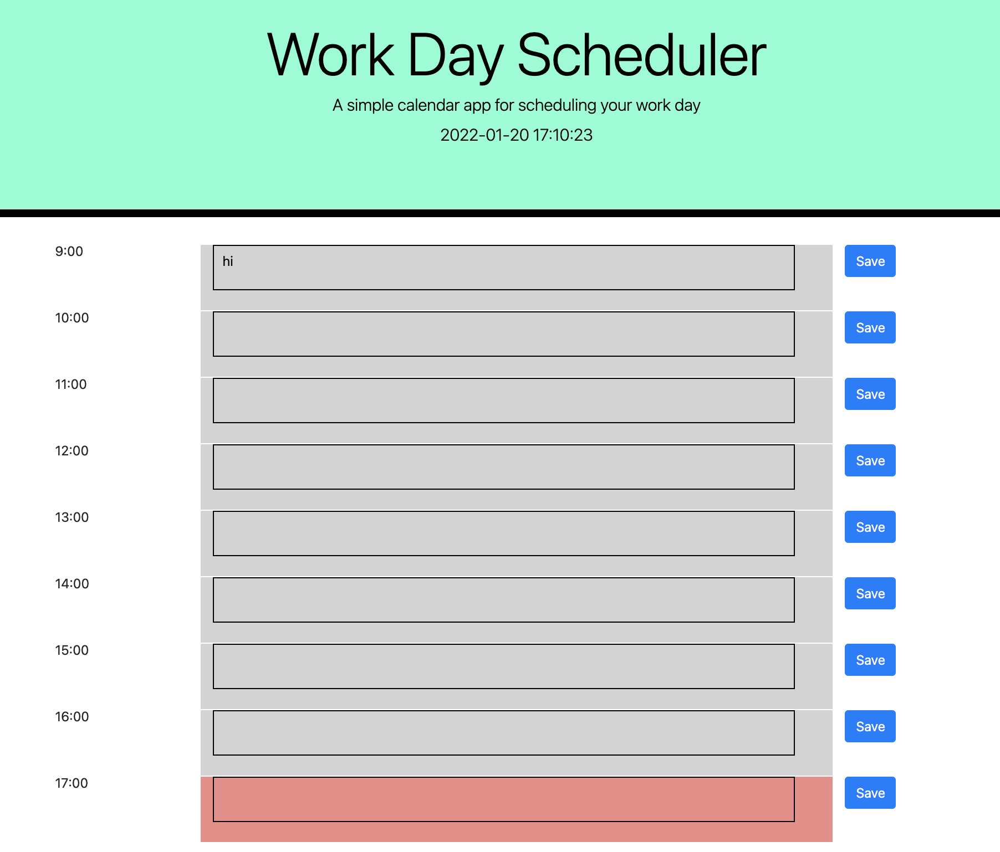

# alpha-man-schedule
This is a generic event schedule, in which the user can save events for the day ion their local storage

# Links to the Repo and Live

Github Repo: https://github.com/kishan254/alpha-man-schedule

Live Url: https://kishan254.github.io/alpha-man-schedule/

# Screenshots for deployed url

# About the project

This project was intended to utilise the skills of showing time and date, storing content in the local storage by clicking the save button, and lastly using the  

const row = $("
").attr("class", "row"); to create the rows of time blocks

I still have so much to learn about programming, I have only started my jounrey it is an amazing experience so far and I am lucky to have help from my friends, and tutors

Hope this project can help you in understadning the simple local storage characteristics
